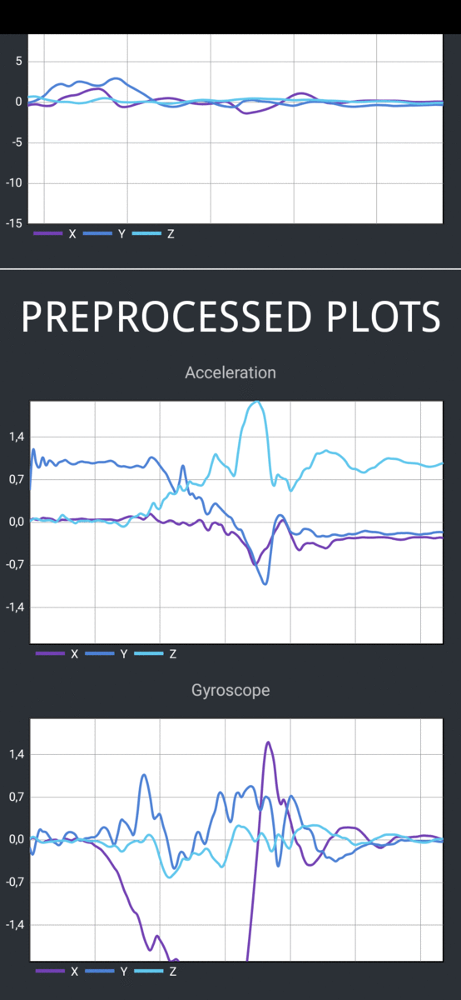

# Human-Activity-Recognition
A public android application for Human Activity Recognition (HAR) based on a Convolutional Neural Network:
  
Authors:  
*Gabriele Gamberi*  
*Antonio Spoleto Junior*
  

